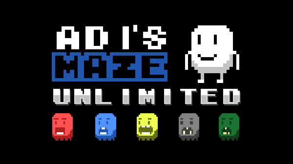

# Adi's Maze Unlimited


A game created by [Ben Williams](https://github.com/blewert) for the original Research Arcade project, that has been up converted into an electron app for use on the new Arcade system.

This project is an electron wrapper from the original phaser project and is designed around Node 20.

Author: Ben Williams

```
Adi's Maze Unlimited is one of the original games created for the Research Arcade project. It is a retro puzzle game in which you have to navigate a maze in order to pass the level! Collect all the coins to win! 

The game was created as a part of a research project studying over a long-term the impact of gender in games. You can read the article at lncn.ac/adis-maze
```

<details>
<summary> Banner Images </summary>




</details>
